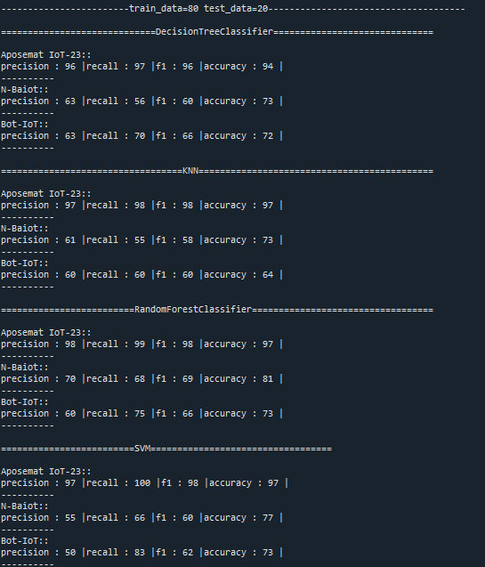
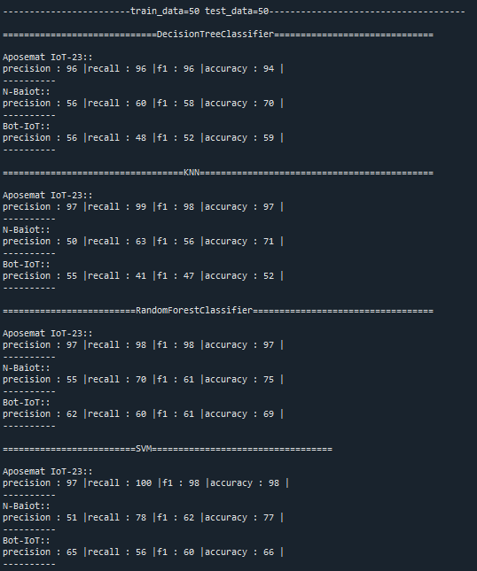

# Cybersecurity ML Algorithms Comparison

A Python machine learning project for evaluating and comparing multiple classification algorithms on cybersecurity datasets using different train/test split ratios.

---

## Features

- Compare multiple Machine Learning algorithms.
- Evaluate cybersecurity datasets.
- Support different train/test split ratios (80/20 and 50/50).
- Calculate Accuracy, Precision, Recall, and F1-Score.
- Display evaluation results in the console.

---

## Algorithms

- Decision Tree
- K-Nearest Neighbors (KNN)
- Random Forest
- Support Vector Machine (SVM)

---

## Project Structure

```
python1.py                 # Main application
Dataset1Train.csv
Dataset1Test.csv
Dataset2Train.csv
Dataset2Test.csv
Dataset3Train.csv
Dataset3Test.csv
Dataset4Train.csv
Dataset4Test.csv
Dataset5Train.csv
Dataset5Test.csv
screenshots/
```

---

## Technologies Used

- Python
- Pandas
- NumPy
- Scikit-learn

---

## Installation

```bash
pip install pandas numpy scikit-learn
```

---

## Run the Project

Execute the main program:

```bash
python python1.py
```

---

## Evaluation Metrics

- Accuracy
- Precision
- Recall
- F1-Score

---

## Results

### Train 80% / Test 20%



### Train 50% / Test 50%



---

## Future Improvements

- Add more machine learning algorithms.
- Support additional cybersecurity datasets.
- Export results to Excel.
- Visualize model performance with charts.

---

## Author

**Abdalwahab Al-Qatawneh**

- GitHub: https://github.com/Abedulwahab
- LinkedIn: https://www.linkedin.com/in/abdalwahab-qatawneh-10101125a/
